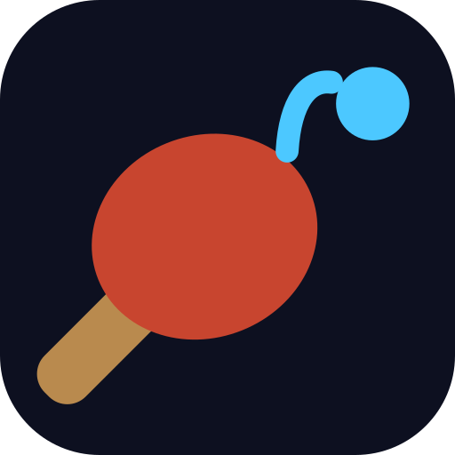

<p align="center"></p>

# PingPong 3D

A fast, physics-driven 3D table-tennis game built with **React Three Fiber**.
Four ways to play: a twelve-stage **Adventure** against AI opponents,
**online** against a friend, local **two-player** on one screen, and the
original **Keep-up** survival mode.

**Play:** https://ibra-kdbra.github.io/PingPong-3D/

## Game modes

### Adventure
Work through twelve opponents of rising skill — from Botan, a cheerful rookie
who telegraphs every shot, to Unit 09, a machine that almost never misses.
Each stage has its own arena theme, win target, and AI personality (paddle
speed, reaction delay, accuracy, aggression, how much spin it plays and how
well it reads yours). From the rooftop on, stages bend the physics:
crosswinds, one-sixth gravity on the Moon Base, a raised net, a glass table
that bounces like a trampoline, a frozen one that barely bounces at all.
Every win is rated one to three stars (a shutout earns three), opponents
talk back after points, and progress is saved locally.

### Online
Create a room, send the six-letter code to a friend, and play a full match
peer-to-peer over WebRTC — no game server. The host runs the authoritative
physics; the guest sees a mirrored view with its own paddle predicted
locally and the ball smoothed between 30 Hz snapshots. Rematch is a
two-way handshake; a dropped connection ends the match cleanly. Design
notes: [NETPLAY.md](NETPLAY.md).

### Two players
Same screen, same table. Player 1 steers with the mouse (height aims the
shot: high lobs, low drives). Player 2 moves with `A`/`D` and aims with
`W`/`S`. First to 7.

### Keep-up
The solo survival mode: keep the ball on your paddle through 8 levels of
rising gravity, wind, and shrinking balls. Combo multipliers, 3 lives,
persistent best score.

## If online play won't connect

Online play is peer-to-peer, so the two browsers must find a network path
to each other. Direct works on most home connections; mobile data, work
or campus Wi-Fi and VPNs commonly block it and need a **relay** (TURN).

Open **Relay server** in the online lobby and press **Test relay** before
you invite anyone. It asks your browser for a relayed address using only
TURN, so it tells you in about a second whether online play will work
from where you are sitting — instead of finding out after a failed join.

The game ships with public relays, but they are free, shared and
best-effort. If the test fails, add one of your own in the same panel. Two
ways to give it to the game:

- **Credentials URL** — a URL the game can `GET` that returns ICE servers
  as JSON. Preferred: the credentials are short-lived and nothing
  long-lived is stored. A free metered.ca account gives you one directly
  (`https://YOUR-APP.metered.live/api/v1/turn/credentials?apiKey=…`).
- **A fixed relay** — address, username and password. Use this for
  providers that mint credentials behind an authenticated request rather
  than a plain URL, Cloudflare among them.

Either can travel in the link you send your friend, so only one of you
has to set it up:

```
https://ibra-kdbra.github.io/PingPong-3D/?ice=https://YOUR-PROVIDER/credentials
https://ibra-kdbra.github.io/PingPong-3D/?turn=turn:HOST:3478&turnuser=USER&turnpass=SECRET
```

If you deploy your own copy, set the `ICE_ENDPOINT` repository secret and
every player gets a relay automatically — see [NETPLAY.md](NETPLAY.md).

The lobby footer shows the build date — handy for checking both players
are on the same version after an update.

## Techniques

| Input | Shot |
| --- | --- |
| Mouse height | Lob (high) … drive (low) |
| Fast swing | Smash — shorter, harder flight |
| **Hold left button while swinging sideways** | **Brush**: sidespin, the ball visibly curves past your aim |
| **Right button** | **Loop**: heavy topspin — arcs high, dips late, kicks off the table |
| **Space** | **Chop**: floating backspin that dies on the bounce |

Player 2 on the keyboard: `A`/`D` move, `W`/`S` aim, `Shift` brush,
`E` loop, `Q` chop. Contact quality matters: a ball met at the edge of
your reach is a weaker, wilder shot — for you and for the AI.

## The match engine

Matches run on a custom, dependency-free table-tennis engine
(`src/game/match.js`) written for speed and testability:

- **Real rules, arcade pacing** — serves alternate every two points; shots
  must clear the net and land on the opponent's half; double bounces,
  nets, and outs are all called with the right point going the right way.
- **Ballistic shot solver** — every stroke solves a real parabolic flight
  to a target point, so net clips and long balls emerge from physics, not
  scripts. Mouse height picks lob vs drive; swing speed adds power (smash)
  and steers placement.
- **Spin** — sidespin curves the flight (Magnus effect). Incidental spin
  from a swing is pre-compensated so the ball lands where aimed; a
  deliberate brush is only partly compensated, so it bends past the aim.
  Topspin dips in flight and kicks low and fast off the table; backspin
  sits up and dies. The AI reads a shot once and commits like a real
  player — stronger opponents anticipate the curve (and use it).
- **Fixed 120 Hz step** — identical physics at any frame rate, and the
  basis for online play.
- **Net cord** — a ball that clips the top of the net loses its pace and
  trickles over, still in play; below the cord it's a fault.
- **Stage physics** — gravity, wind, net height and table bounce are all
  per-match parameters the campaign plays with.
- **Rally pressure** — shot error grows as a rally drags on, so points
  always resolve and long rallies get tense.
- **Zero allocations in the hot path** — the engine mutates one state
  object and reuses event buffers; React renders only on point changes.
- **Unit-tested in Node** — `npm test` simulates thousands of engine steps:
  serve legality, fault attribution, service rotation, match completion,
  long AI-vs-bot matches, Magnus curves, net cords, spin bounces, gravity
  and net-height modifiers, spin-reading AI — all headless with a seeded
  RNG.

## Feel

Ball shadow on the table so you can read where it lands, a spin-twisted
rolling ball, impact rings on every hit and bounce, camera shake on smashes
and points, a live rally counter, match-point calls, and a one-liner from
your opponent after each point.

## Performance

- Adaptive quality: a performance monitor watches the real frame rate and
  permanently degrades cost (shadows, particles, resolution cap) the
  moment a device can't hold the target — no oscillating quality.
- Device pixel ratio capped at 1.75, `high-performance` GPU preference.
- All per-frame game state lives in refs and mutated objects; the React
  tree re-renders only on scores, phases, and banners.

## Controls

| Input | Action |
| --- | --- |
| Mouse / touch | Move paddle · mouse height aims lob/drive (match modes) |
| Left button + swing / right button / `Space` | Brush (curve) / loop / chop |
| `A` `D` / `W` `S` / `Shift` `E` `Q` | Player 2 move / aim / brush, loop, chop |
| `P` or `Esc` | Pause / resume |
| `M` | Mute / unmute |

## Setup

Download [Node.js](https://nodejs.org/en/download/), then:

```bash
npm install     # first time only
npm run dev     # local dev server
npm test        # match-engine unit tests
npm run build   # production build (outputs to docs/)
npm run preview # preview the production build
```

## Project structure

```
src/
├── game/
│   ├── match.js      # table-tennis engine: physics, spin, rules, AI (pure JS)
│   ├── stages.js     # adventure opponents, physics twists, themes, star rating
│   ├── fx.js         # frame-level effect channel (camera shake)
│   ├── store.js      # zustand state machine for all modes
│   ├── levels.js     # keep-up level definitions
│   ├── collision.js  # cannon collision filter groups (keep-up)
│   └── audio.js      # pooled hit sounds + WebAudio synth cues
├── components/
│   ├── Scene.jsx       # mode routing, environment, adaptive quality
│   ├── MatchScene.jsx  # table, net, paddles, engine loop
│   ├── Paddle.jsx      # keep-up glove paddle (cannon kinematic body)
│   ├── Ball.jsx        # keep-up ball: trail, wind, stall detection
│   ├── Arena.jsx       # keep-up bounds + themed floor
│   └── Text.jsx        # 3D score digits on the keep-up paddle
├── net/
│   ├── transport.js  # PeerJS (WebRTC) transport + in-process loopback
│   ├── session.js    # host-authoritative session: inputs, snapshots, events
│   └── current.js    # the live connection (outside React state)
├── ui/
│   ├── HUD.jsx       # mode-aware HUD: scoreboard, lives, combo, banners
│   ├── Screens.jsx   # menu, adventure map, online lobby, pause, endings
│   ├── Logo.jsx      # the mark, inline SVG
│   └── icons.jsx     # inline SVG icons
└── Experience.jsx    # canvas + UI shell + keyboard shortcuts
tests/
├── match.test.mjs      # rules: serves, faults, rotation, match flow
├── physics.test.mjs    # spin, net cord, bounces, modifiers, AI spin-reading
├── techniques.test.mjs # brush curve, loop, chop, compensation
└── net.test.mjs        # online: handshake, inputs, snapshots, smoothing, rematch
```

Deploys: every push to `main` (and the preview branch) builds, tests and
publishes to GitHub Pages via `.github/workflows/deploy.yml`.

## Roadmap

- [ ] Online: choose a stage/physics twist for the room; spectators
- [ ] Tournament mode: best-of-3 sets, seeded brackets
- [ ] Replays of match points
- [ ] Gamepad support
